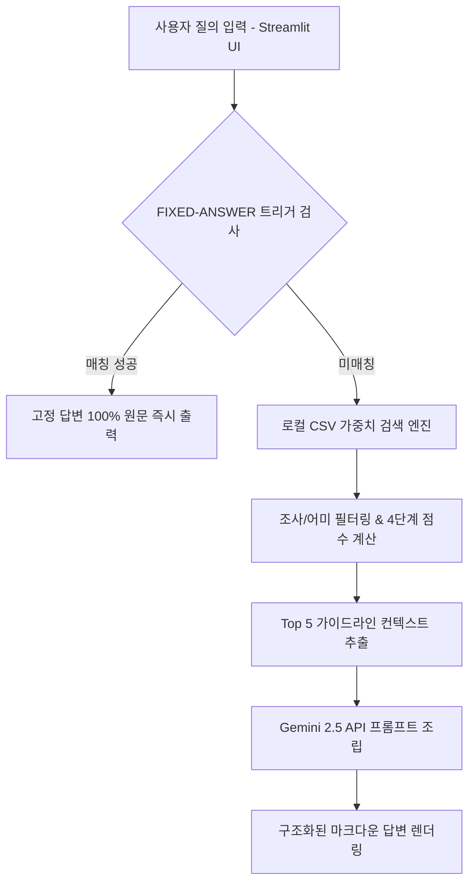

# ✈️ 하나투어 브랜드 똑순이 AI 챗봇 & 에셋 센터


> **하나투어 임직원 및 파트너사를 위한 지능형 브랜드 가이드라인 챗봇 & 에셋 다운로드 센터**  
> 브랜드 일관성은 지키고, 자산 접근성은 높입니다.

---

## 📌 목차 (Table of Contents)
- [1. 프로젝트 개요](#1-프로젝트-개요)
- [2. 주요 기능](#2-주요-기능)
- [3. 시스템 아키텍처](#3-시스템-아키텍처)
- [4. 디렉토리 구조](#4-디렉토리-구조)
- [5. 모듈별 역할](#5-모듈별-역할)
- [6. 설치 및 실행 방법](#6-설치-및-실행-방법)
- [7. 주요 브랜드 문의처](#7-주요-브랜드-문의처)

---

## 1. 프로젝트 개요

하나투어 브랜드 똑순이는 사내 브랜드 가이드라인 문서(1,047줄)와 365개 세부 에셋 데이터(203개 고유 구글드라이브 폴더)를 기반으로 작동하는 **실시간 질의응답 챗봇 및 통합 에셋 브라우저**입니다.

### 💡 도입 목적
1. **복잡한 규정의 즉시 확인**: 로고 사용 원칙, 지정 색상, 폰트, 공식인증예약센터 간판 설치 규정, SNS 밈 사용 원칙 등 방대한 규칙을 대화형으로 검색.
2. **구버전 자산 오남용 방지**: 203개 공식 에셋 폴더를 실시간 연결하여 항상 최신 원본 파일만 다운로드하도록 유도.
3. **브랜드마케팅팀 응대 공수 절감**: 반복되는 단순 에셋 지원 및 규정 확인 문의 자동화.

---

## 2. 주요 기능

### 🎯 1) 100% 원문 보장 `FIXED-ANSWER` 엔진
AI의 환각(Hallucination) 현상을 완전히 차단하기 위해 **브랜드 핵심 규정**은 시스템 지시문 원문 그대로 100% 동일하게 출력합니다.
- **적용 대상**: 브랜드 로고(CI/BI 표), 컬러 스펙, 공식인증예약센터 간판 설치 권한, SNS 4대 운영 원칙, 지정 폰트 다운로드, 주요 수상이력, 담당자 연락처

### 🔍 2) 한국어 특화 4단계 가중치 검색 엔진
한국어 조사 및 어미 필터링 후 4단계 가중치 매칭 알고리즘 수행:
- **정확한 단어 일치**: +5점
- **질문(Question) 컬럼 매칭**: +3점
- **키워드(Keyword) 컬럼 매칭**: +2점
- **답변(Answer) 컬럼 매칭**: +1점

### 📂 3) 203개 에셋 폴더 통합 브라우저 (`asset_browser`)
- 총 365개 세부 에셋 파일을 14개 카테고리(로고, 명함, 간판, 디지털, 폰트, 브랜드 규정집 등)로 자동 정규화.
- 3열 카드 그리드 디자인 및 구글 드라이브 폴더 직통 링크 제공.

### 🎨 4) 하나투어 시그니처 디자인 시스템
- 하나투어 고유 시그니처 퍼플(`#5E2BB8`) 및 민트(`#08D1D9`) 그래디언트 테마 적용.
- 자주 묻는 질문 10종 원클릭 퀵 질문 버튼 및 스마트 뷰 스위칭 지원.

---

## 3. 시스템 아키텍처



---

## 4. 디렉토리 구조

```text
hanatour_brand_bot/
├── app.py                      # Streamlit 웹 메인 애플리케이션 및 UI 레이아웃
├── gemini_client.py            # Gemini API 호출 및 FIXED-ANSWER 고정 답변 제어 모듈
├── search_engine.py            # CSV 데이터 로드, 스키마 정규화 및 가중치 검색 엔진
├── asset_browser.py            # 203개 에셋 폴더 다운로드 브라우저 통합 모듈
├── FINAL_VERSION_지시문.txt    # 시스템 마스터 지시문 (1,047줄 시스템 프롬프트)
├── data/
│   ├── assets.csv              # 365행 세부 에셋 데이터셋 (대분류, 항목, 보유확장자, 링크)
│   ├── faq.csv                 # 브랜드 FAQ 데이터셋
│   ├── signage.csv             # 간판 및 사인시스템 규정 데이터셋
│   └── zeusworld.csv           # 제우스월드 브랜드 데이터셋
└── requirements.txt            # 프로젝트 의존성 라이브러리 목록
```

---

## 5. 모듈별 역할

| 모듈명 | 주요 내용 |
|---|---|
| [`app.py`](file:///Users/hi259/.gemini/antigravity/scratch/hanatour_brand_bot/app.py) | 사이드바 퀵 질문 버튼, 메시지 세션 관리, 메인 챗 패널 및 에셋 브라우저 뷰 스위칭 |
| [`gemini_client.py`](file:///Users/hi259/.gemini/antigravity/scratch/hanatour_brand_bot/gemini_client.py) | `FIXED_ANSWERS` 딕셔너리 관리, `check_fixed_answer()` 트리거 매핑 및 Gemini 2.5 API 통신 |
| [`search_engine.py`](file:///Users/hi259/.gemini/antigravity/scratch/hanatour_brand_bot/search_engine.py) | `data/` 내 모든 CSV 통합 로드, 필드 정규화, 한국어 어근 추출 및 매칭 스코어 계산 |
| [`asset_browser.py`](file:///Users/hi259/.gemini/antigravity/scratch/hanatour_brand_bot/asset_browser.py) | 14개 그룹 아코디언, 실시간 에셋 키워드 검색 및 구글 드라이브 카드 그리드 UI |
| [`FINAL_VERSION_지시문.txt`](file:///Users/hi259/.gemini/antigravity/scratch/hanatour_brand_bot/FINAL_VERSION_지시문.txt) | 챗봇 페르소나, intent 분류, FIXED-ANSWER 블록 7종, 데이터-규칙 분리 원칙 정의 |

---

## 6. 설치 및 실행 방법

### 1) 프로젝트 클론 및 가상환경 생성
```bash
git clone https://github.com/hanatour/brand-bot.git
cd brand-bot
python3 -m venv .venv
source .venv/bin/activate
```

### 2) 필수 패키지 설치
```bash
pip install -r requirements.txt
```

### 3) 환경 변수 설정 (선택 사항)
Gemini API 키를 환경 변수로 등록할 수 있습니다. (미설정 시 로컬 엔진으로 작동)
```bash
export GEMINI_API_KEY="your_api_key_here"
```

### 4) Streamlit 앱 실행
```bash
streamlit run app.py
```
실행 후 브라우저에서 `http://localhost:8501` (또는 지정 포트)로 접속합니다.

---

## 7. 주요 브랜드 문의처

- **디자인·로고·가이드라인·브랜드 에셋·폰트·컬러·검수**
  - 이승현G 선임 (내선 6725)
  - 백솜이 선임 (내선 7051)
- **브랜드 소개·정의·체계·수상인증·비즈링**
  - 천성해 선임 (내선 1911)

---
*Copyright ⓒ HanaTour Service Inc. All Rights Reserved.*
